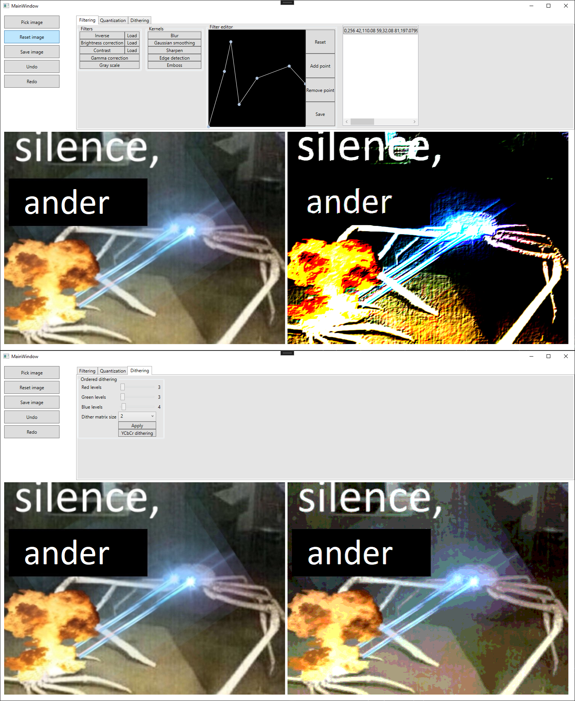
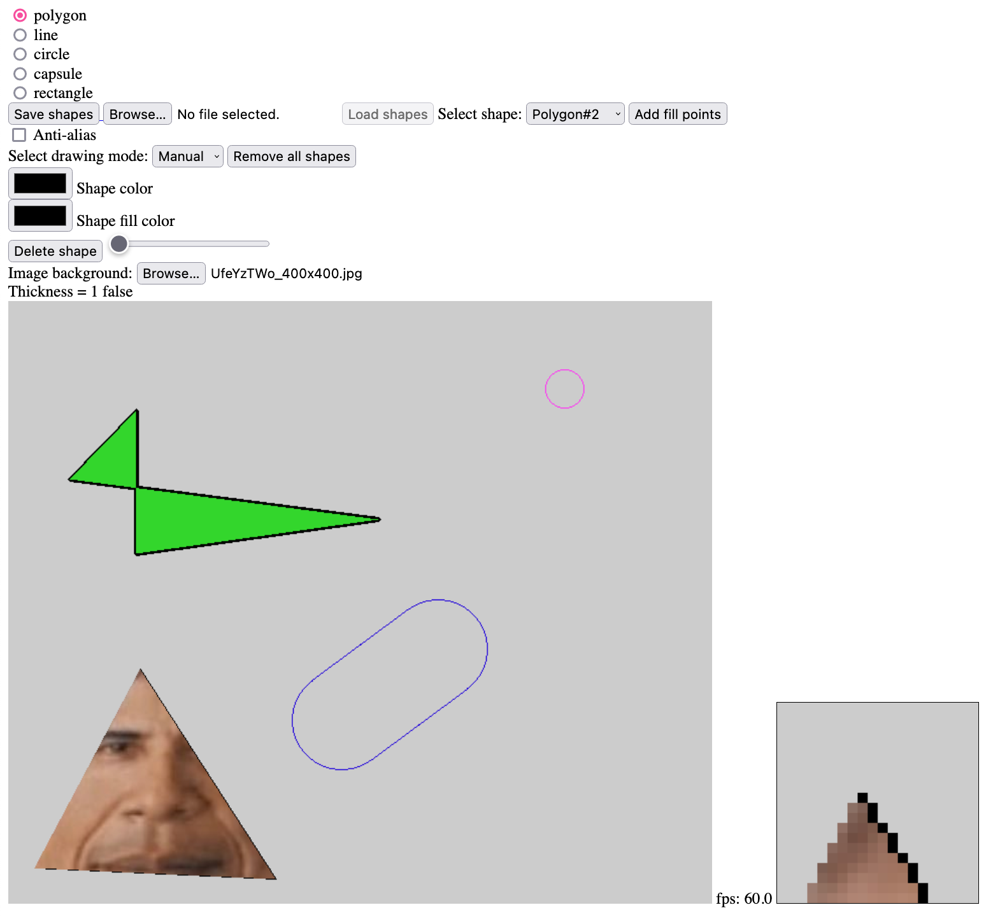
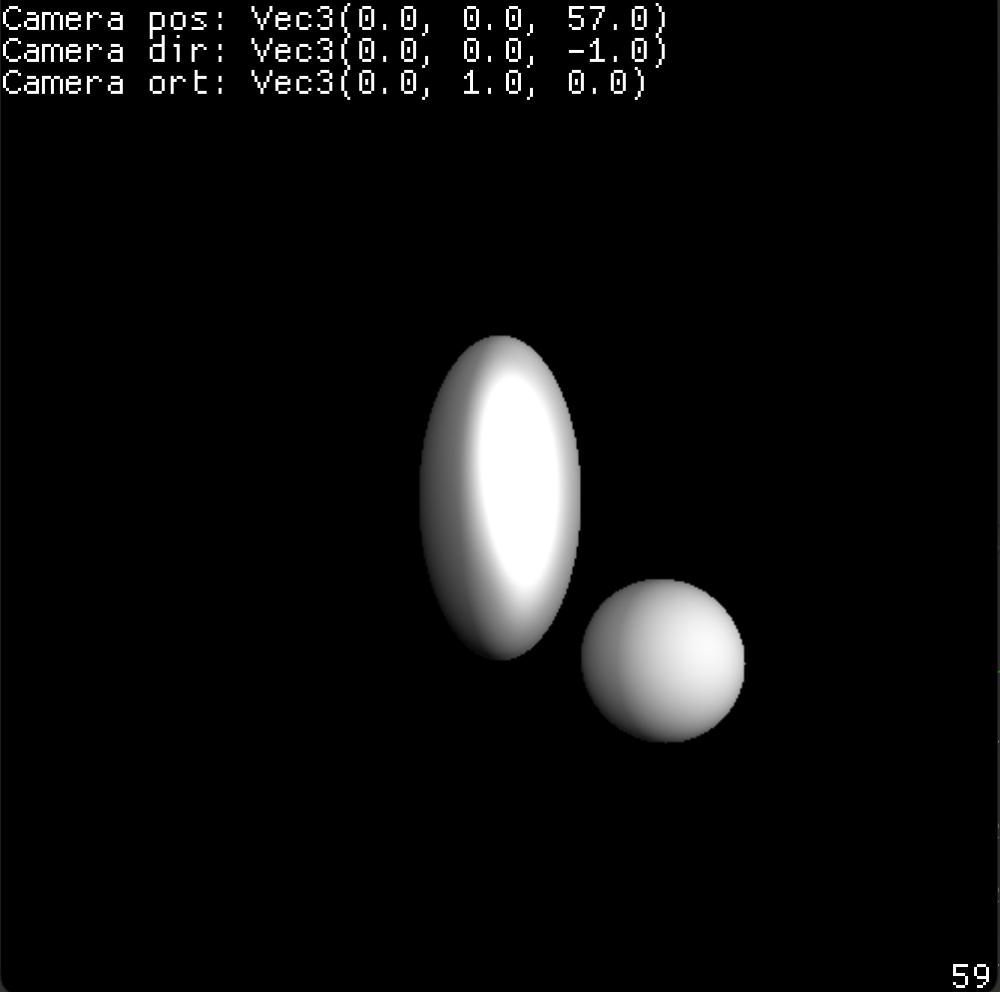

# Computer graphics course

## ImageFiltering

[A C# WPF program](./ImageFiltering) for applying various filters to images. These include:

- Ordered dithering
- Color inverting
- Brightness correction
- Contrast correction
- Gamma correction
- Greyscale
- Custom filter from a built in polyline editor
- Uniform quantization
- (Gaussian) Blur
- Sharpening
- Edge detection
- Emboss

## rasterisation

[A TypeScript lit program](./rasterisation) (hosted at [github.shilangyu.dev/WUT-CG](github.shilangyu.dev/WUT-CG)) for applying rasterisation techniques to vector elements. These include:

- Drawing shapes (polygons, lines, circles, capsules)
- Filling shapes (with solid color or bitmap images)
- Moving shapes (by a face, edge, or vertex)
- Changing line thickness
- Anti-alias
- Saving/loading drawings in a vector format
- Magnifier to inspect individual pixels
- Press-to-fill

## raycaster

[A Rust macroquad program](./raycaster) running a raycaster from scratch. Features:

- Camera configuration
- Lights configuration
- Material configuration
- Pixel-by-pixel rendering
- Objects:
  - point cloud
  - ellipsoid
  - plane
  - sphere
- Moving camera position/orientation/direction

